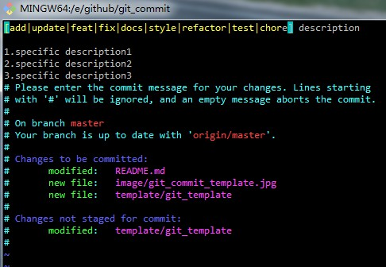

# git commit 规范文档

## 1.概述

git-commit 规范下gerrit(git) 上面提交信息，顺便整理git信息整理，作为参考，欢迎fork本文档后pull request,来完善本文文档，以下演示提交都已**git bash**为基础

## 2.正文

### 2.1 gerrit使用
gerrit使用参考平台 **Gerrit普通开发指导文档.doc**，不再叙述，这边主要讲述下提交

### 2.2 gerrit git 提交模板

#### 2.2.1 进入提交

如果之前提交 都是 先 **git add -A** 后 再 **git commit -m "balabala"**,这样的提交方法 commit 的话只能提交一行信息，导致不能过多的描述信息，所以要改变**commit**命令，**git add -A** 后 再 **git commit**，进入vi编辑提交信息

- 直接 敲入 **git commit** 进如 vi


- 在vi 模式下敲入提交信息，eg: vi 模式下 **i键** 进入**编辑**，按 **esc键**再输入 **:wq** 进行保存


#### 2.2.2 提交信息模板
提交分为两部分 Summary 和 Description

##### 2.2.2.1 Summary  概述

概述主要用描述了大概做了什么事情，是Add 添加说明新文件，还是 Update 更新了某个文件.或者Fix 修复了某个bug或者冲突

大致格式如下

```
<type>(<scope>): <subject>// 空一行<body>// 空一行<footer>
```
**（1）type**

type用于说明 commit 的类别，可以使用下面标识。

add：添加新文件

update：更新某个文件

feat：新功能（feature）

fix：修补bug

docs：文档（documentation）

style： 格式（不影响代码运行的变动）

refactor：重构（即不是新增功能，也不是修改bug的代码变动）

test：增加测试

chore：构建过程或辅助工具的变动

如果type为feat和fix，则该 commit 将肯定出现在 Change log 之中。其他情况（docs、chore、style、refactor、test）由你决定，要不要放入 Change log，建议是不要。

**（2）scope**

scope用于说明 commit 影响的范围，比如数据层、控制层、视图层等等，视项目不同而不同。

**（3）subject**

subject是 commit 目的的简短描述，不超过50个字符。

以动词开头，使用第一人称现在时，比如change，而不是changed或changes

第一个字母小写

结尾不加句号（.）

##### 2.2.2.2 Description 具体描述
在 summy 基础上回车换行 继续写具体描述，可以 1.，2.，3.罗列出来


#### 2.3 其它说明

可以敲入 **git log --oneline** 显示 summary 一行概述，可见按照规范的提交，log清晰明了


#### 2.4 模板说明
针对上面描述建立模板使用说明，位置在 template/git_template

##### 2.4.1模板使用说明

- 输入以下命令输入模板细信息

``` 
git config --global commit.template  模板地址
```

>eg:

``` 
git config --global commit.template  /E/github/git_commit/template/git_template
```

- 然后按照模板提交


## 3.参考

[Git 提交的正确姿势：Commit message 编写指南](http://www.oschina.net/news/69705/git-commit-message-and-changelog-guide)

[如何写好 Git commit log?](https://www.zhihu.com/question/21209619/answer/257574960)

[git commit 时使用 Emoji](https://zhuanlan.zhihu.com/p/29764863)

[廖雪峰Git教程](https://www.liaoxuefeng.com/wiki/0013739516305929606dd18361248578c67b8067c8c017b000)

